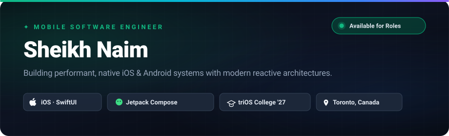

  

 

  
  &nbsp;
  
  &nbsp;
  
  &nbsp;
  

 

## Executive Summary

I am a Toronto-based **Mobile Software Engineer** specializing in native **iOS (Swift / SwiftUI)** and **Android (Kotlin / Jetpack Compose)** ecosystems. Currently completing the *Mobile Web Developer Using AI* diploma at **triOS College** (Class of 2027), I engineer clean, scalable mobile applications rooted in Apple Human Interface Guidelines and Google Material Design 3.

My development focus centers on **unidirectional data flow**, **declarative reactive UIs**, **local-first persistent storage (SwiftData / Room DB)**, and **hardware sensor integrations**.

---

## Featured Engineering Projects

### [Spendora](https://github.com/snaimio/Spendora) — iOS Subscription & Expense Engine
> **Stack:** `Swift` · `SwiftUI` · `SwiftData` · `WidgetKit` · `UserNotifications`

- **Architecture:** Local-first MVVM architecture prioritizing user data privacy with zero external tracking.
- **Widgets & Backgrounding:** Interactive Home Screen & Lock Screen widgets via WidgetKit with dynamic timeline reloading.
- **Notifications:** Local push scheduling for impending subscription renewals and payment deadlines.
- **Persistence:** High-performance local persistence with SwiftData models, schema migrations, and relational queries.

🔗 **[Explore Spendora Repository →](https://github.com/snaimio/Spendora)**

---

### [LifeScore](https://github.com/snaimio/lifescore-android-app) — Gamified Android Lifestyle & Growth Platform
> **Stack:** `Kotlin` · `Jetpack Compose` · `Hilt DI` · `Room DB` · `Coroutines / Flow` · `WorkManager`

- **Multi-Dimension Tracking:** Modular tracking across 8 core life dimensions with deterministic scoring algorithms.
- **Dependency Injection:** Scalable architecture using Hilt for lifecycle-aware dependency inversion.
- **Background Sync:** Reliable daily reset scheduling and background metric aggregation with WorkManager.
- **Reactive UI:** 100% Jetpack Compose single-activity architecture leveraging StateFlow and immutable UI states.

🔗 **[Explore LifeScore Repository →](https://github.com/snaimio/lifescore-android-app)**

---

### [Nourishly](https://github.com/snaimio/Nourishly) — Smart Recipe Companion & Guided Cook Engine
> **Stack:** `Swift` · `SwiftUI` · `Firebase Auth` · `Cloud Firestore` · `TheMealDB API` · `AVFoundation`

- **Cook Mode:** Distraction-free, step-by-step guided cooking workflow with automated instruction timer extraction and haptic alerts.
- **Dual Persistence:** Hybrid storage architecture combining local cache with live Cloud Firestore synchronization for authenticated profiles.
- **Robust Networking:** Async/await REST integration with TheMealDB, supporting search, random meal discovery, and localized category filtering.

🔗 **[Explore Nourishly Repository →](https://github.com/snaimio/Nourishly)**

---

### [Sensor ToolBox](https://github.com/snaimio/AndroidApp3) — Real-Time Hardware Telemetry Suite
> **Stack:** `Kotlin` · `Android SensorManager` · `Coroutines` · `Canvas Graphics`

- **Low-Latency Telemetry:** High-frequency event sampling across Accelerometer, Gyroscope, Magnetometer, and Orientation sensors.
- **Signal Processing:** Implemented digital low-pass filtering to isolate gravitational force from user acceleration.
- **Visual Feedback:** Custom dynamic compass dial and real-time sensor vector plots rendered via Compose Canvas.

🔗 **[Explore Sensor ToolBox Repository →](https://github.com/snaimio/AndroidApp3)**

---

## Technical Competencies

| Domain | Core Technologies & Methodologies |
| :--- | :--- |
| **iOS Development** | Swift 5.10+, SwiftUI, SwiftData, Core Data, WidgetKit, UserNotifications, MapKit, AVFoundation, Combine, Concurrency (async/await, Actors) |
| **Android Development** | Kotlin, Jetpack Compose, Coroutines, Flow / StateFlow, Room Database, Hilt / Dagger, Retrofit 2, WorkManager, SensorManager, Navigation Compose |
| **Architectures & Design** | MVVM, Clean Architecture, Unidirectional Data Flow (UDF), Repository Pattern, Apple HIG, Material Design 3 |
| **Web & Cloud Services** | HTML5, CSS3, JavaScript (ES6+), TypeScript, Firebase Authentication, Cloud Firestore, RESTful APIs, JSON Parsing |
| **Tooling & Environments** | Xcode, Android Studio, Git / GitHub, Postman, Figma, CocoaPods, Swift Package Manager (SPM), macOS / Linux Terminal |

---

## Education & Academic Experience

- **triOS College** *(Toronto, ON)* — **Mobile Web Developer Using AI** *(2024 – 2027)*
  - Academic focus: iOS Development with Swift/SwiftUI, Android Development with Kotlin/Compose, Enterprise Database Systems, Cloud Services & AI API Integration.
- **Software Developer Intern** — *Digital Solutions Lab*
  - Collaborated in an Agile development team delivering modular user interface components and integrating REST services.

---

## GitHub Performance & Overview

  
  &nbsp;
  

 

  

---

  © 2026 Sheikh Naim · Engineered with precision · Toronto, Canada

